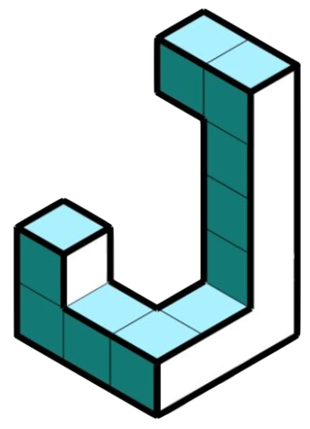
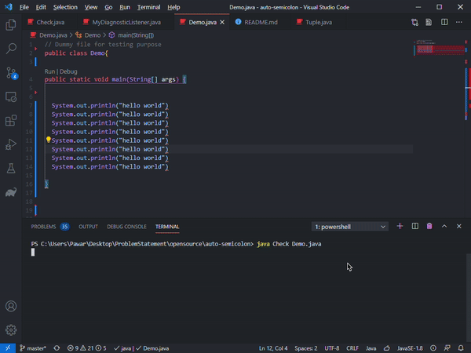

  <a href="https://github.com/ashishpawar517/AutoCompiler">
    
    <h1 align="center">AutoCompiler</h1>
  </a>

  
  
  

  

  

</a>

## Getting Started

- Solves common programming errors automatically.
- Powered by Java Compiler API.

<!-- ## Documentation

WIP -->

## What is AutoCompiler?
An automation project to solve compile-time errors on the fly. The idea started with an argument like if a compiler is smart enough to tell us that there’s a missing semi colon on line 17 then why is it can't just a semicolon there. That's what Autocompiler aims to do. See it in action.

## Community

The AutoCompiler community can be found on [GitHub Discussions](https://github.com/ashishpawar517/AutoCompiler/discussions), where you can ask questions, voice ideas, and share your thoughts.

## Contributing

Please see our [contributing.md](/CONTRIBUTING.md).

### Good First Issues

We have a list of [good first issues](https://github.com/ashishpawar517/AutoCompiler/labels/good%20first%20issue) that contain bugs which have a relatively limited scope. This is a great place to get started, gain experience, and get familiar with our contribution process.

## Authors

- Aashish Pawar ([@ashishpawar517](https://github.com/ashishpawar517)) 
- Tauseef Ansari ([@tauseefansari](https://github.com/tauseefansari)) 

 
