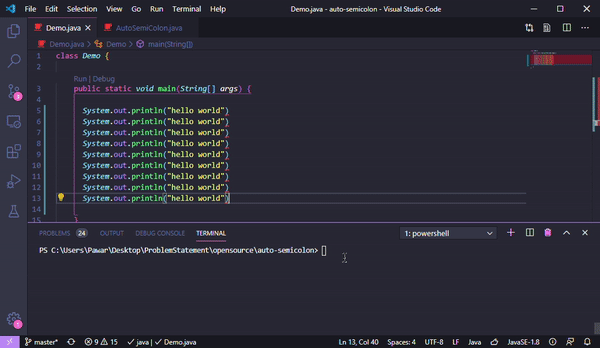

# Java AutoCompiler

- Solves common programming errors such as missing semicolons and brackets.
- Powered by Java Compiler API





<!-- > ##### Tip -->
<!-- Format Document after the execution -->

> ## Usage

```console
  $> java Check Demo.java
```

> ## Current Tasks

  - Integrate with javac command.
  - Multiple Errors on Single Line.
  - Infinite loop indentification.

> ## Wants to Contribute ?

- If you want to help us improve, take a minute to read the [Contribution Guidelines](CONTRIBUTING.md) first.
- If you find a any problem ,  please [open an issue](https://github.com/pawarashish564/AutoCompiler/issues/new).

Initial Release : 
#### 1.0 