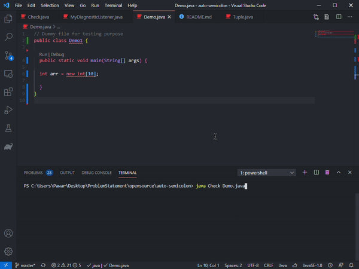

# Java AutoCompiler

- Solves common programming errors automatically.
- Powered by Java Compiler API.

<center> 

[](https://www.java.com/)

</center>

> ## Level 1 Errors (semicolon/ bracket missing)


> ## Level 2 Errors (public class name / array initialization )



<!-- > ##### Tip -->
<!-- Format Document after the execution -->

> ## Usage

```console
  $> java Check Demo.java
```

> ## Current Tasks

  - Integrate with javac command.
  - Multiple Errors on Single Line.
 
> ## Wants to Contribute ?

- If you want to help us improve, take a minute to read the [Contribution Guidelines](CONTRIBUTING.md) first.
- If you find a any problem ,  please [open an issue](https://github.com/pawarashish564/AutoCompiler/issues/new).

## Initial Release : 
 1.0 