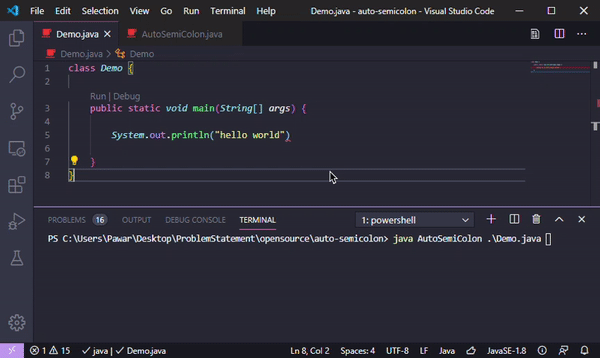

> ## Java AutoSemiColon

- Add semicolons to your java files automatically
- Powered by Java Compiler API

Initial Release
1.0

> ##### Current Tasks
  - Add semicolons without messsing with Formatting
  - Long java AutoSemiColon command to Set path variable (automatically)
  - Integrate with javac command.

> ##### Tip
Format Document after the executio